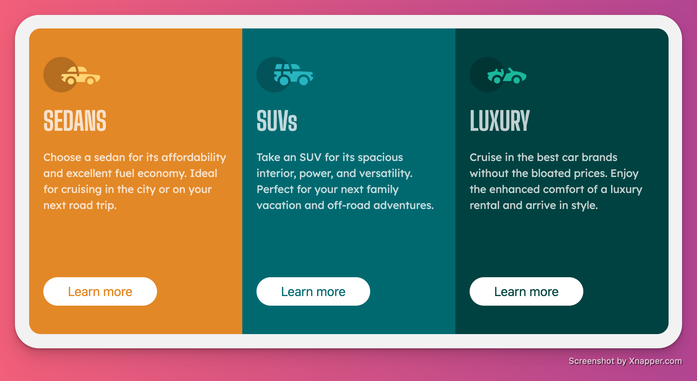

# Frontend Mentor - 3-column preview card component solution

This is a solution to the [3-column preview card component challenge on Frontend Mentor](https://www.frontendmentor.io/challenges/3column-preview-card-component-pH92eAR2-). Frontend Mentor challenges help you improve your coding skills by building realistic projects. 

## Table of contents

- [Overview](#overview)
  - [The challenge](#the-challenge)
  - [Screenshot](#screenshot)
  - [Links](#links)
- [My process](#my-process)
  - [Built with](#built-with)
  - [Continued development](#continued-development)
- [Author](#author)
- [Acknowledgments](#acknowledgments)

## Overview

### The challenge

Users should be able to:

- View the optimal layout depending on their device's screen size
- See hover states for interactive elements

### Screenshot

### Links

- Solution URL: [https://your-solution-url.com]
- Live Site URL: [https://maciej-kalisz.github.io/3ColumnPreview/]

## My process

### Built with

- Semantic HTML5 markup
- TailwindCSS v3.1.8 (via CDN)
- Flexbox

### Continued development

This project definitely showed me how far my responsive design skills need to be improved. 
Building from this, I'm going to start working with a mobile-first workflow which, as evidenced by this project, will save me a massive amount of time.

## Author

- Website - [My personal website (W.I.P)](https://www.maciejkalisz.co.uk)
- Frontend Mentor - [@Maciej-Kalisz](https://www.frontendmentor.io/profile/Maciej-Kalisz)
- GitHub - [@Maciej-Kalisz](https://github.com/Maciej-Kalisz)

## Acknowledgments

I appreciate the support from the official Tailwind discord when I got stuck on a (admittedly rather simple) issue. Very kind people all around